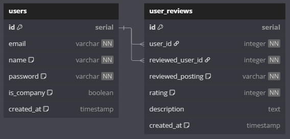

# Databaser

## SQL



https://dbdiagram.io/d

```dbml
Table users {
  id serial [pk]
  email varchar [not null, unique]
  name varchar [not null, note: "name / company name"]
  password varchar [not null, note: "hashed password"]
  is_company boolean [default: false, note: "is company or private person"]
  created_at timestamp [default: `CURRENT_TIMESTAMP`, note: "auto generated by SQL"]
}

Table user_reviews {
  id serial [pk]
  user_id integer [not null]
  reviewed_user_id integer [not null]
  reviewed_posting varchar [not null, note: "postings._id from MongoDB"]
  rating integer [not null, note: "1-5 stars"]
  description text
  created_at timestamp [default: `CURRENT_TIMESTAMP`, note: "auto generated by SQL"]
}

Ref: users.id < user_reviews.user_id
Ref: users.id < user_reviews.reviewed_user_id
```

## Redis

**Ofte brugte søgninger?**

Search predictions ift. recent searches.

Ex. hvis jeg søger på "gaming pc" så gemmer Redis det i en liste i lidt tid, så når en anden person søger på "gaming" så kan vi vise dem "gaming pc" som en prediction.

For hver ekstra søgning vi får på "gaming pc" så opdaterer vi listen i Redis, så den bliver mere relevant, og gemmes i længere tid.

**Mest sete postings**

Vi har en liste med ZSET i Redis `views:current_hour`, og bruger `ZINCRBY views:current_hour 1 {postingId}` for at opdatere den.

Hver gang klokken bliver X:00, så har vi et cron job / scheduled task der kører `ZREVRANGE views:current_hour 0 24 WITHSCORES` og gemmer de 10 mest sete postings i en liste `views:top_10` i Redis.

**Indkøbskurv**

Første gang en bruger logger ind på siden opretter vi en slags `Set-Cookie: sessionId=<UUID>; Secure; HttpOnly; SameSite=Lax; Max-Age=86400` som gemmes på siden og sendes med i alle requests.

Vi laver så en `cart:{sessionId}` i Redis som indeholder en liste over alle varer (postings.\_id fra Mongo) i kurven:

```json
{
  "sessionId": "", // Required, from cookie
  "items": [
    {
      "postingId": "", // Required, from MongoDB postings._id
      "quantity": , // Required, default 1
      "title": "", // Required, from MongoDB postings.title
      "price": , // Required, from MongoDB postings.price
    },
  ]
}
```

## MongoDB

Vi laver en `postings` document i MongoDB, som indeholder alle salgsopslag.

```json
{
    "_id": ObjectId("..."), // Auto generated by MongoDB
    "user_id": Integer, // Required, from SQL users table
    "title": String, // Required
    "price": Number, // Required
    "status": String, // Required, "deleted", "active", "inactive"
    "description": String, // Optional
    "category": String, // Required
    "item_count": Integer, // Required, 1 as default
    "location_city": String, // Optional
    "location_country": String, // Required
    "specifications": [ // Optional
        {
            "key": String, // Required
            "value": String // Required
        }
    ]
}
```

Vi laver en `payment_log` document i MongoDB, som indeholder en log over alle betalinger.

```json
{
    "_id": ObjectId("..."), // Auto generated by MongoDB
    "user_email": String, // Required, from SQL users table
    "total_amount": Number, // Required
    "created_at": Date, // Auto generated by MongoDB
    "items": [
        {
            "posting_id": ObjectId("..."), // Auto generated by MongoDB
            "seller_id": Integer, // Required, from SQL users table
            "title": String, // Required
            "price": Number, // Required
            "description": String, // Optional
            "quantity": Integer, // Required, 1 as default
            "review_id": Integer, // Optional, from SQL user_reviews table
            "specifications": [ // Optional
                {
                    "key": String, // Required
                    "value": String // Required
                }
            ]
       },
    ]
}
```
