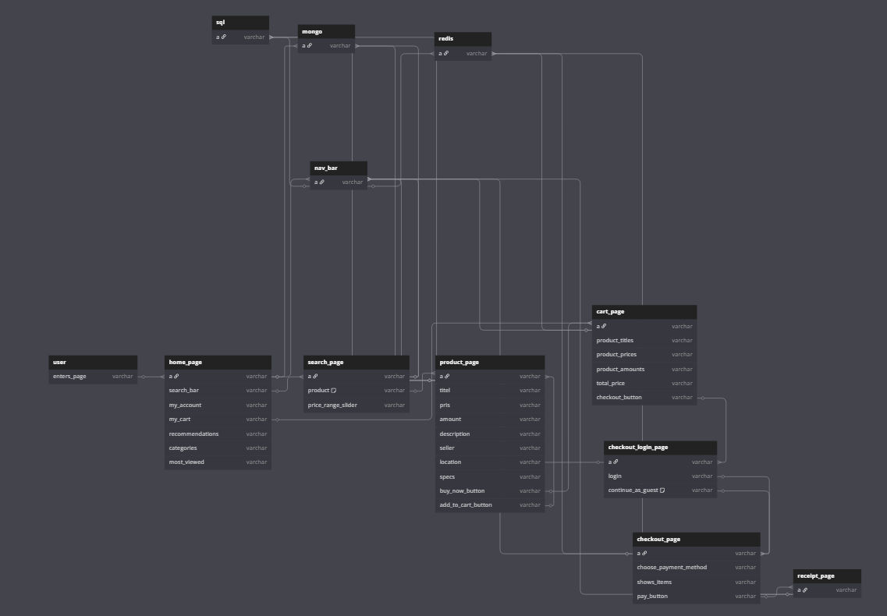

# Flowplan for Website

We used this to agree on how the website should work, and how the databases are connected to the different websites.

After we had agreed on the flowplan, we created a Figma wireframe design of the website, which can be found in the Figma link: [https://www.figma.com/design/nWOhshppeVPFIs6OLiwxru/DB-Exam-Figma](https://www.figma.com/design/nWOhshppeVPFIs6OLiwxru/DB-Exam-Figma)



https://dbdiagram.io/d

```
Table sql {
  a varchar
}

Table mongo {
  a varchar
}

Table redis {
  a varchar
}

Table user {
  enters_page varchar
}

Table home_page {
  a varchar
  search_bar varchar
  my_account varchar
  my_cart varchar
  recommendations varchar
  categories varchar
  most_viewed varchar
}

Ref: user.enters_page < home_page.a
Ref "Recommendations, Categories": home_page.a < mongo.a

Table search_page {
  a varchar
  product varchar [note: "Hver product indeholder Titel, Pris, Add To Cart"]
  price_range_slider varchar
}

Ref: home_page.search_bar < search_page.a
Ref "Products": search_page.a < mongo.a

Table product_page {
  a varchar
  titel varchar
  pris varchar
  amount varchar
  description varchar
  seller varchar
  location varchar
  specs varchar
  buy_now_button varchar
  add_to_cart_button varchar
}

Ref: search_page.product < product_page.a
Ref "My Cart-amount opdateres i UI": product_page.add_to_cart_button < product_page.a
Ref "Titel, Pris, Amount, Desc, Location, Specs, (SellerID)": product_page.a < mongo.a
Ref "mongo.SellerID -> seller": product_page.a < sql.a

Table cart_page {
  a varchar
  product_titles varchar
  product_prices varchar
  product_amounts varchar
  total_price varchar
  checkout_button varchar
}

Ref: home_page.my_cart < cart_page.a
Ref: product_page.buy_now_button < cart_page.a
Ref "Products": cart_page.a < redis.a

Table checkout_login_page {
  a varchar
  login varchar
  continue_as_guest varchar [note: "Skriv email + tlf nummer, måske"]
}

Ref: cart_page.checkout_button < checkout_login_page.a
Ref "Check if User exist": checkout_login_page.a < sql.a

Table checkout_page {
  a varchar
  choose_payment_method varchar
  shows_items varchar
  pay_button varchar
}

Ref: checkout_login_page.login < checkout_page.a
Ref: checkout_login_page.continue_as_guest < checkout_page.a
Ref "Card expiration (5min), show items": checkout_page.a < redis.a

Table receipt_page {
  a varchar
}

Ref: checkout_page.pay_button < receipt_page.a
Ref "receipt": receipt_page.a < redis.a

Table nav_bar {
  a varchar
}

Ref "My Account": nav_bar.a < sql.a
Ref "Most Viewed, My Cart": nav_bar.a < redis.a

Ref: home_page.a < nav_bar.a
Ref: search_page.a < nav_bar.a
Ref: product_page.a < nav_bar.a
Ref: cart_page.a < nav_bar.a
Ref: checkout_page.a < nav_bar.a
Ref: receipt_page.a < nav_bar.a
```
